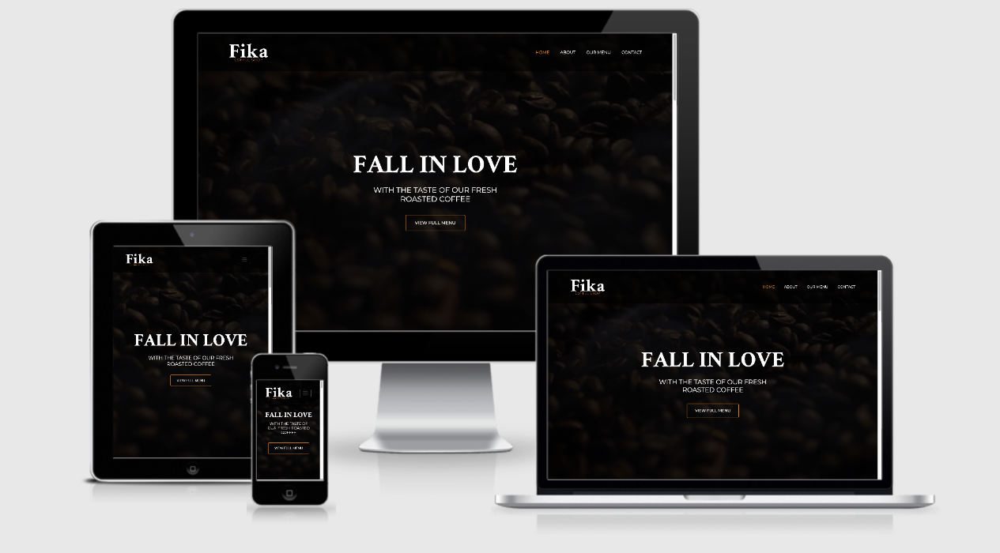
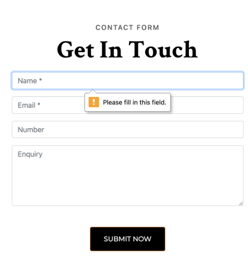
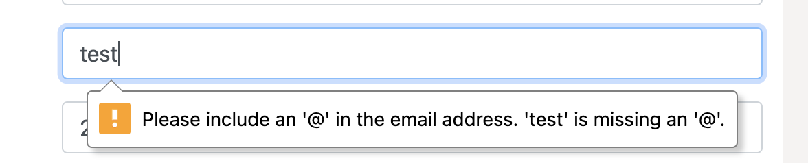
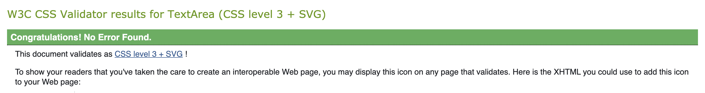
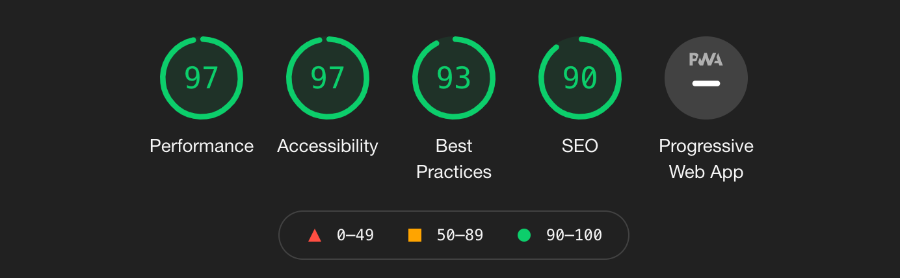
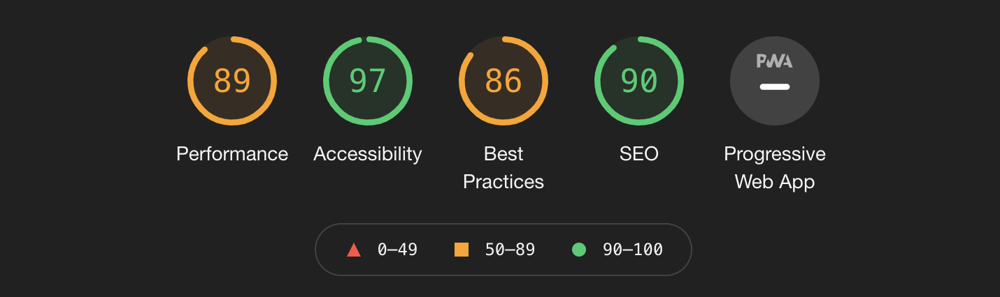
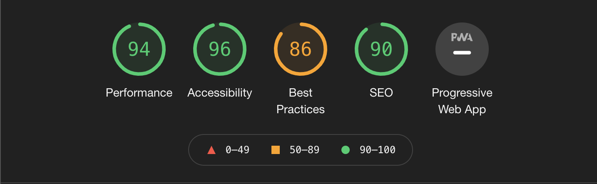
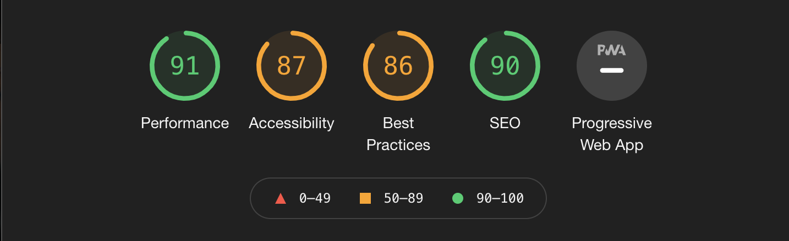

# Fika Coffee Shop

This Fictional Website was created as part of my Milestone 1 project for my Full Stack Developer Course with Code Institute.
The Goal was to display my knowledge of front-end development skills in which I did by creating a 4 page static Coffee Shop website with a clean, modern design 
thats is straight forward to follow for users on the site.

[>> View the live site here <<](https://hellyryan1995.github.io/Fika-Coffee-Shop-Project-MS1/index.html)



---

# UX

## STRATEGY

### Focus
The site owner has a newly built Coffee Shop based in the local village of ferns he is currently using Facebook, 
Instagram and twitter but wishes to take the final step in creating an online presence by creating a website where customers 
can easily contact the Coffee shop and review there constantly updating Menu.

### Definition
The Site owner requires a brand new website to accompany his brand new coffee shop allow customers to easily and clearly 
find what they are looking for.

### Value
Building this site gives the owner the full online presence he is looking for along with make customers aware of the 
coffee shops locations and what is available via the menu.

## SCOPE

### External user’s goal:
* The site's users are potential customer, who want to know more about what’s on the menu.
* Customers can easily locate the Coffee shop given its based inside a village.
* Everything is easy to find on site appealing to customers to come back to the site.

### Site owner's goal:
* FIKA Coffee Shop is interested in attracting and retaining customers.
* Display there menu.
* Online Presence.
* Insure customers are aware of there opening hours.

### Potential features to include:
* Coffee Shop Menu
* About the Coffee shop
* Home page
* Whats new
* Gallery
* Contact/Location

## STRUCTURE

### Interaction Design
We want to entice customers visiting the website to show an interest in our menu of what is available to drink and eat 
and from there using our google maps location, easily find the place.

### Requirements
* Displaying new products that become available
* Display Company's opening hours
* Viewing the Menu
* The location will be available.
* Information on the company and the Coffee beans used.
* Display Active Social media icons

### Information Architecture
1. We want the menu navigation to go like Home, About, Our Menu and Contact / Location,  
This is the most effective way of displaying it as we are telling a story as we go along from right to left in the menu.

2. We want the Menu to be displayed completely on the site to make it easier for customers, 
also will be displayed is all new Coffees at the very top.

3. We want Contact details, and location displayed on the same page, insuring customers don’t 
have to click around the site searching for information.

4. The preference for the home page is attracting customers to view the menu 
whilst also displaying any new coffee that has become available.

5. Display Opening Hours.

6. Give customers a back story on the brand new Coffee Shop and where our fresh Coffee beans come from.

## SKELETON

### Wireframes - Desktop / Tablet / Mobile
* [Home](assets/images/wireframes/Fika-Home-Page.pdf)
* [About](assets/images/wireframes/Fika-About-Page.pdf)
* [Our Menu](assets/images/wireframes/Fika-Our-menu.pdf)
* [Contact](assets/images/wireframes/Fika-Contact-page.pdf)

## SURFACE

[Home Page Mockup](assets/images/readme-images/Desktop-Home-Fika-Coffee-shop.pdf)

### Fonts
* Crimson Text - 700 Bold

* Montserrat - 400 Regular

### Colours
 |  |  | 
--- | --- | --- | ---
#EE8726 | #000000 | #535353 | #F6F3F2 

# Features

## Existing Features

* Responsive on all devices.

* Simple Navbar design so users can easily navigate through each page.

* Opening hours displyed on the home page and inside the footer.

* Social media icons displayed in the footer and contact page.

* New Menu items displayed clearly on both the home and our menu page.

* Clean menu layout for the users.

* Gallery section giving users an insight to the coffee shop.

* Google maps of location displayed in contact page.

* Simple contact form for user to contact the company of any question they have.

* Bold, large imagery and text so users can clearly find what there looking for on the site.

## Features Left to Implement

* In the future for takeaway customers I would like to add the abilty to purchase your order through the site and select the time you will be arriving to collect it 
so its prepared the second the customer enters the store.

# Technologies Used

* [HTML](https://en.wikipedia.org/wiki/HTML)
    * For Structuring the site.

* [CSS](https://en.wikipedia.org/wiki/CSS)
    * For Styling the Site.

* [Bootstrap](https://getbootstrap.com/)
    * For Grid Layout & Components.

* [Font Awesome](https://fontawesome.com/)
    * For certain icons.

* [Google Font](https://fonts.google.com/)
    * For two selected fonts.

* [JQuery](https://jquery.com/)
    * For working with Burger menu in mobile view.

* [Github](https://github.com/)
    * Storing project on.

* [Balsamiq](https://balsamiq.com/wireframes/?gclid=Cj0KCQiA3smABhCjARIsAKtrg6JfbE3I-05NWUBL17jlkE6uDkROXDoD5vXo7UJxVKIjsLVwujyaus0aAhAiEALw_wcB)
    * Creating wireframes on.

* [Google Chrome Developer Tool](https://developers.google.com/web/tools/chrome-devtools)
    * Checking my site is responsive on multiple different devices.

* [Affinity Photo](https://affinity.serif.com/en-gb/photo/)
    * Editing my imagery for the website.

* [Affinity Designer](https://affinity.serif.com/en-gb/designer/)
    * Creating Fika Coffee Shop Logo


# Testing

* Throught the developement of the site I used Chrome developer Tool to insure site is responsive on all devices.

* Devices tested on:
    * Macbook Pro 13"
    * Lg 27" Monitor
    * iPhone 11
    * All devices in inspector tool.

* Browsers Tested on:
    * Google Chrome
    * Safari
    * Firefox

## UX User Stories

1. Navbar is displayed clearly and constantly on the top right of every page with the text colour displayed 
in orange on the active page so users are aware of what page they are on.

2. Upon entering the Our Menu page, users are displayed with a clear menu along with three new menu items at the top.

3. Upon entering the Contact page, users are shown a contact form on the left as well as contact details on the right
and directly below is the google maps location ensuring users can easily locate the coffee shop.

4. On the home page the website has a full width & height banner displayed when first visiting the site with a button
leading directly to the menu.

5. Users are made aware of the coffee shops opening hours as they are displayed in large on the home page and throughout the footer.

6. The about page provides users the background story of the company and the coffee.


## Manual Testing

1. Navbar
    * Contected to each page correctly.
    * Clicking the logo will bring you back to the home page.
    * hover effect on all menu items.
    * Active colour on menu items.

2. Buttons
    * Buttons all have a hover effect on them.
    * All "View Full Menu" buttons lead directly to Our Menu Page.
    * All "Contact Us" Buttons lead directly to Contact Page.
    * All " Find Out More" Buttons lead directly to the About Page.

3. Our Menu 
    * Icons displayed on desktop and tablet but removed in mobile view for better usability.

4. Contact form
    * On Contact Page the contact form is displayed.
    * Required forms are Name & Email which a warning is displayed if left empty.
        
    * Warning displayed when email not entered correctly.
        
    * Page refreshes when form is filled out correctly.

5. Google maps
    * On Contact Page google maps is displayed.
    * fully functional and responsive.

6. Socail Icons
    * Displayed in Footer and Contact page.
    * Links open in new tab.
    * Hover effect applied to each socail.

7. Gallery
    * Displayed on Home & About page.
    * Fully responsive.
    * some images removed in mobile view.
    

## Testing code

The HTML and CSS was tested through W3C Markup Validator & W3C CSS Validator.

* W3C Markup Validator Results
    * Home Page - [Results](https://validator.w3.org/nu/?doc=https%3A%2F%2Fhellyryan1995.github.io%2FFika-Coffee-Shop-Project-MS1%2Findex.html)
    * About Page - [Results](https://validator.w3.org/nu/?doc=https%3A%2F%2Fhellyryan1995.github.io%2FFika-Coffee-Shop-Project-MS1%2Fabout.html)
    * Our Menu Page - [Results](https://validator.w3.org/nu/?doc=https%3A%2F%2Fhellyryan1995.github.io%2FFika-Coffee-Shop-Project-MS1%2Fourmenu.html)
    * Contact Page - [Results](https://validator.w3.org/nu/?doc=https%3A%2F%2Fhellyryan1995.github.io%2FFika-Coffee-Shop-Project-MS1%2Fcontact.html)

* W3C CSS Validator



## Testing Perfomance

Tested through Lighthouse in the Chrome Inspector Tool.

 |
--- |
Home Page |

 |
--- |
About Page |

 |
--- |
Our Menu Page |

 |
--- |
Contact Page |

## Bugs Discovered

* Problem1 - I was unable to add a background video with a text overlay.
```
Banner with Video wasnt working
<div class=" section">
    <div class="video-container">
        <video autoplay muted>
            <source src="videos/coffee_bean6.mp4" type="video/mp4">
        </video> Help From W3school on video

        <div class="header-text">
            <section class="text-center header-text">
                <h1 class="title">FALL IN LOVE</h1>
                <h2 class="second-text">WITH THE TASTE OF OUR FRESH ROASTED COFFEE</h2>
                <button type="button" class="btn btn-outline-primary">VIEW FULL MENU</button>
            </section>
        </div>
    </div>
</div>
```
* Problem1 SOLVED - I eventaully came to the idea of converting the video into a lower res and cropped gif where I used it as a background image which worked out better as it lowered the size of the file.
```
    <div class="container-fluid img-container bg-opacity">
        <div class="row">
            <div class="col-12">
                <section class="text-center header-text">
                    <h1 class="title">FALL IN LOVE</h1>
                    <h2 class="second-text">WITH THE TASTE OF OUR FRESH ROASTED COFFEE</h2>
                    <a class="btn btn-outline-primary" href="ourmenu.html" role="button">VIEW FULL MENU</a>
                    
                </section>
            </div>
        </div>
    </div>

    .img-container {
        height: 100vh;
        background: url('../images/coffee-beans-BG.gif') rgba(0, 0, 0, .65)no-repeat bottom right fixed;
        -webkit-background-size: cover;
        -moz-background-size: cover;
        -o-background-size: cover;
        background-size: cover;
        background-blend-mode: multiply; /* Code From overflow*/
        display: flex;
        align-items: center;
        justify-content: center;
        position: relative;
}
```

# Deployment

This project was developed using GitPod and commits where made throught git and was pushed to github as my version control.

Take the following steps to deploy this project from its GitHub repository:

1. Login to [GitHub](https://github.com/)
2. Select "Repositories" on the menu.
3. Whilst in the list of Repositories select the one called - ["Fika-Coffee-Shop-Project-MS1"](https://github.com/hellyryan1995/Fika-Coffee-Shop-Project-MS1).
4. On the second menu from the top select "Settings".
5. Scroll down until you get to "GitHub Pages".
6. Under source change the dropdown menu from "none" to "Master" and click save.
7. The page will automatically refresh.
8. Scroll down to "GitHub Pages" again and you will see the link to the deployed site.

## How to run this project locally

1. Create and account with [GitHub](https://github.com/)
2. Use Chrome browser.
3. Install the [GitPod](https://chrome.google.com/webstore/detail/gitpod-dev-environments-i/dodmmooeoklaejobgleioelladacbeki) browser extension.
4. Login to your GitPod account or sign up [here](https://www.gitpod.io/)
5. Go into the GitHub repository called ["Fika-Coffee-Shop-Project-MS1"](https://github.com/hellyryan1995/Fika-Coffee-Shop-Project-MS1)
6. Select the green button named "GitPod"
8. This will open a new Gitpod workspace containing the code so you can work locally.

Here are the steps to take to clone the project:

1. From GitHub, venture over to "Repositories" from the second menu down.
2. selected respitory project called ["Fika-Coffee-Shop-Project-MS1"](https://github.com/hellyryan1995/Fika-Coffee-Shop-Project-MS1)
3. To the left of the green GitPod button select the button name "code".
4. you will be given the option to clone or download the project.
5. Under clone there is a HTTPS which you should copy.
6. In your Local IDE on your terminal.
7. Change your current working directory to the location where you want the clone to be made.
8. Enter "git clone" and paste in the code you copied in step 5
```
git clone https://github.com/hellyryan1995/Fika-Coffee-Shop-Project-MS1.git

```
9. Press enter and your local clone will be created.

# CREDITS

## Content

* Code used to help position the logo on the right the menu on the left - [codegrepper.com](https://www.codegrepper.com/code-examples/delphi/bootstrap+4+navbar+logo+left+menu+right)

* Code used to remove menu icons on mobile view - [stackoverflow](https://stackoverflow.com/questions/39819510/remove-an-object-when-on-mobile)

* Code used to add colour overlay over background image - [stackoverflow](https://stackoverflow.com/questions/36679649/how-to-add-a-color-overlay-to-a-background-image)

* Grid System and Components from - [Boostrap](https://getbootstrap.com/docs/5.0/layout/grid/)

* All written content was done by me.

## Media

* Pixabay - [Sandwhich](https://pixabay.com/photos/sandwich-appetizer-food-snack-dish-1238615/)

* Cleanpng - [Hazelnut](https://www.cleanpng.com/png-hazelnut-food-common-hazel-nutella-walnut-cream-281137/) - [Redvelvet-cake](https://www.cleanpng.com/png-red-velvet-cake-cheesecake-fudge-cake-dessert-choc-918683/) - 
[Honeycomb](https://www.cleanpng.com/png-honey-bee-honeycomb-comb-honey-honey-141425/
)

* Pexels - [Coffee-Beans-Spilled](https://www.pexels.com/photo/photo-of-spilled-coffee-beans-977878/)

* Freepik - [Coffee-Cup-Mockup](https://www.freepik.com/free-psd/coffee-cup-store-low-angle_11631353.htm#page=1&query=coffee%20logo%20mockup&position=1)

* Pexels - [Cappucino-Close-Up](https://www.pexels.com/photo/art-blur-cappuccino-close-up-302899/)

* Pexels - [Coffee-and-phone](https://www.pexels.com/photo/coffee-contact-email-hands-4831/)

* Freepik - [Shop-Sign-Mockup](https://www.freepik.com/free-psd/coffee-shop-premium-quality-board-mockup_3574877.htm)

* Pixabay - [Coffee-Grinds](https://pixabay.com/photos/coffee-coffee-grinds-cafe-206142/)

* Flaticon - [Menu-Icons](https://www.flaticon.com/packs/beverage-7)


## Acknowledgements

* Help from my Mentor

* Help from Code Institute lessons